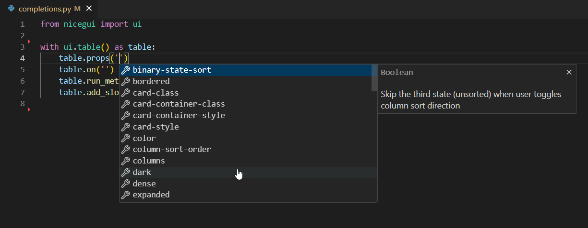
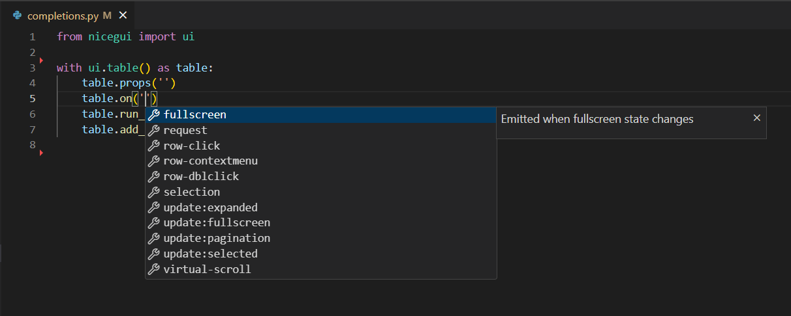
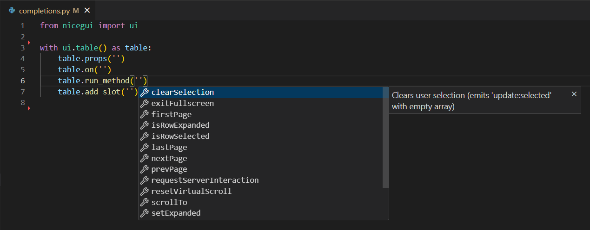
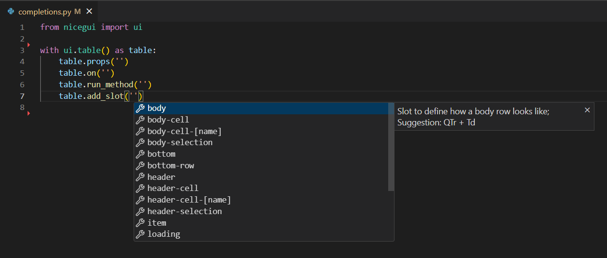

# NiceGUI extension for Visual Studio Code

A Visual Studio Code extension with rich support for the [NiceGUI](https://nicegui.io) UI framework.

### Features
- syntax highlighting for embedded HTML/CSS strings
- completions for Tailwind/CSS in `.classes()` method
- completions for Quasar props, events, methods, and slots
  
### Todo
- completions for style attributes
- NiceGUI snippets

## Screenshots

Tailwind Completions in `.classes()` method

Quasar Completions

Syntax Highlighting for HTML/CSS strings

