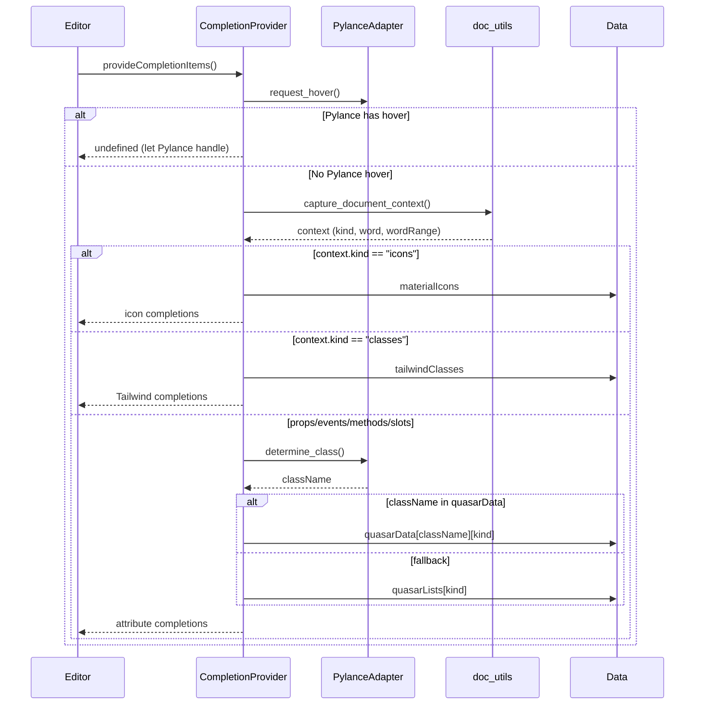

# Completion Provider

**File:** `src/providers/completions.ts`

## Purpose
Provides context-aware completions for NiceGUI Python files, including:
- Tailwind CSS classes in `.classes()` method calls
- Quasar props, events, methods, and slots
- Material Design icons
- Prop value completions (enum choices)

## How It Works

## Key Functions

### `build_completions(list, word, wordRange)`
Filters completion list by partial word match. Returns all items if word is empty.

### `build_item(name, attr)`
Constructs a `CompletionItem` with:
- Label with type signature (for methods)
- Snippet insert text (for slots with placeholders, props with values)
- Markdown documentation with examples and value choices

## Context Kinds Handled

| Kind | Source | Behavior |
|------|--------|----------|
| `icons` | `material_icons.json` | Direct icon name completions |
| `classes` | `tailwind_classes.json` | Tailwind class completions |
| `props` | `quasar_components.json` or `quasar_lists.json` | Prop names with value snippets |
| `events` | `quasar_components.json` or `quasar_lists.json` | Event handler names |
| `methods` | `quasar_components.json` or `quasar_lists.json` | Method signatures |
| `slots` | `quasar_components.json` or `quasar_lists.json` | Slot names with snippet placeholders |

## Pylance Integration
The provider checks if Pylance can provide completions first. If Pylance returns a hover, the extension yields to Pylance. This prevents conflict with existing Python IntelliSense.

See also: [pylance.md](./pylance.md) for LSP communication details.