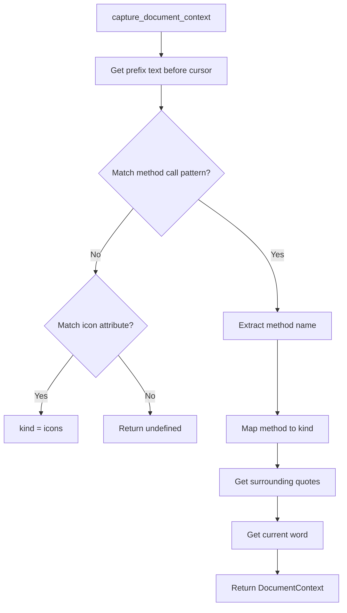

# Document Context Capture

**File:** `src/providers/doc_utils.ts`

## Purpose
Analyzes cursor position in a document to determine what kind of completions/hovers to provide.

## DocumentContext Interface

```typescript
interface DocumentContext {
  document: TextDocument;
  position: Position;
  result: RegExpMatchArray | null;  // The regex match
  method: string;                     // e.g., "classes", "props", "on"
  kind: ContextMethod;                // Normalized kind
  surroundRange: Range;               // Range of surrounding quotes
  surround: string;                   // Quote character used
  wordRange: Range;                   // Range of current word
  word: string;                       // Current word being typed
  className?: string;                 // Element class (populated later)
}
```

## Context Kinds

Method calls are mapped to context kinds:

| Method | Kind |
|--------|------|
| `.classes()` | `classes` |
| `.props()` | `props` |
| `.style()` | `style` |
| `.on()` | `events` |
| `.run_method()` | `methods` |
| `.add_slot()` | `slots` |
| `icon=` attribute | `icons` |

## Detection Logic



## Regex Patterns

### Method Detection
```javascript
/\.\s*(props|classes|style|on|run_method|add_slot)\s*\(\s*[^\)]+$/
```

Matches incomplete method calls at end of prefix.

### Surrounding Quotes
```javascript
/(?<=(["']))(?:(?=(\\?))\2.)*?(?=\1)/
```

Captures quoted string content.

### Word Pattern
```javascript
/[\.\w\/-=]+|([\"'])\1/
```

Matches words including punctuation for paths and assignments.