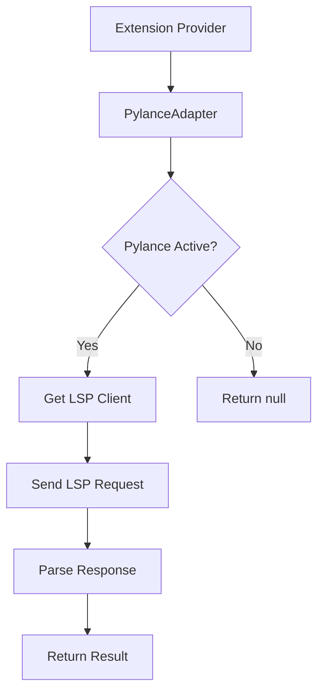

# Pylance Adapter

**File:** `src/providers/pylance.ts`

## Purpose
Bridges the extension to the Pylance language server for Python type inference. Enables determining the NiceGUI element class being used, which allows targeted Quasar component completions.

## Architecture



## Key Methods

### `get_client()`
Returns the Pylance LSP client for direct communication. Returns null if Pylance is not active.

### `send_request(method, params)`
Sends raw LSP request to Pylance. Used for custom LSP calls.

### `request_hover(document, position)`
Requests hover information at a position. Returns the hover content string or null.

### `request_type(document, position)`
Requests type definition at position. Experimental/unused.

### `determine_class(document, kind, offset)`
Main entry point. Determines the NiceGUI element class from context.

**Conversion Rules:**
1. Extract class name from Pylance hover response
2. Prefix with `Q` (NiceGUI → Quasar)
3. Replace `Button` → `Btn`
4. Replace `Image` → `Img`
5. Convert to lowercase

## Hover Parsing

### For `classes`, `props`, `style`
Parses hover response matching:
```
(property) classes: Classes[Self@ClassName]
```
Returns `ClassName`

### For `events`
Parses hover response matching:
```
(method) def on(...) -> ReturnType
```
Returns `ReturnType`

### For `methods`, `slots`
Uses fallback parsing:
1. Try parsing `(variable) name: ClassName`
2. Try parsing `class ClassName(`

## Dependencies
- Requires Pylance extension (`ms-python.vscode-pylance`) to be installed and active
- Uses internal `_connection` API (may be unstable across Pylance versions)